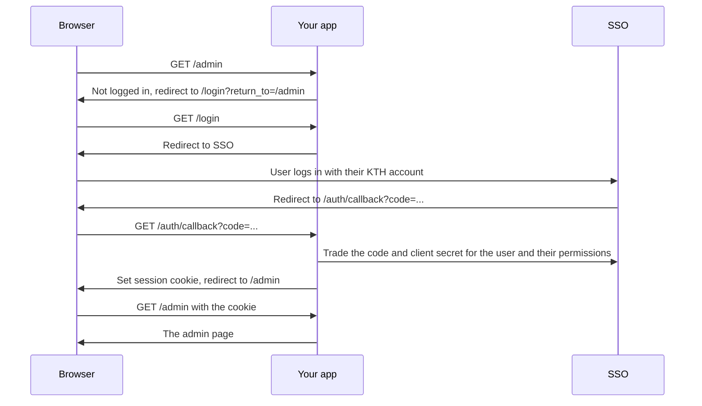

# GO-auth-yourself

Adds login, session cookies and permissions to your Go web app. Users log in with their KTH account through Datasektionen's SSO, and you can restrict what people can see and do based on their permissions in Hive (Datasektionen's permission system).

> **Starting a new system?** Use [OG-template](https://github.com/datasektionen/OG-template). It already uses this library and includes a local test login, so you can skip most of this page.

## Install

```sh
go get github.com/datasektionen/GO-auth-yourself
```

The package is called `auth`, so import it like this:

```go
import auth "github.com/datasektionen/GO-auth-yourself"
```

## Quick start

Add this where you set up your `http.ServeMux`, usually in `main`:

```go
authenticator, err := auth.New(context.Background(), auth.ConfigFromEnv())
if err != nil {
	log.Fatal(err)
}

authenticator.MountAuthRoutes(mux) // adds /login, /auth/callback and /logout

// Open to everyone.
mux.Handle("GET /{$}", http.HandlerFunc(home))

// Any logged-in user.
mux.Handle("GET /profile", authenticator.RequireLogin(http.HandlerFunc(profile)))

// Only users with the "admin" permission.
mux.Handle("GET /admin", authenticator.RequirePermissions("admin")(http.HandlerFunc(admin)))

// Makes the logged-in user available to every route through auth.FromContext.
log.Fatal(http.ListenAndServe(":3000", authenticator.SessionMiddleware(mux)))
```

For a complete app, see [OG-template's `internal/web/web.go`](https://github.com/datasektionen/OG-template/blob/main/internal/web/web.go).

Protect a route (page, form handler or API endpoint) by wrapping it in one of these:

| Wrapper                        | Who gets in                                | Visitor who is not logged in                       |
| ------------------------------ | ------------------------------------------ | -------------------------------------------------- |
| `RequireLogin`                 | Any logged-in user                         | Sent to the login page, then back to the same page |
| `RequirePermissions("a", "b")` | Users with at least one of the permissions | Same as above                                      |

Requests other than GET, such as form posts, get `401 Unauthorized` instead of a redirect. A logged-in user without the right permission gets `403 Forbidden`.

Routes without a wrapper are open to everyone. They can still check who is logged in with `auth.FromContext`, because `SessionMiddleware` wraps the whole mux (the last line of the example above).

## Running locally

You don't need a real SSO client to develop. [nyckeln-under-dorrmattan](https://github.com/datasektionen/nyckeln-under-dorrmattan) is a fake SSO with test users that runs in Docker. Copy the `nyckeln` service and its config from [OG-template's compose.yaml](https://github.com/datasektionen/OG-template/blob/main/compose.yaml), set the [configuration](#configuration) to the nyckeln values, and open `http://localhost:3000/login`. If your app also runs in Docker, copy the `nginx.conf` config too, since `localhost:7003` inside the app container doesn't reach nyckeln otherwise. Test users and their permissions are set under `hive` in the nyckeln config.

## Going to production

1. Ask D-Sys to register an SSO (OIDC) client for your system with the redirect URL `https://<your-system>.datasektionen.se/auth/callback`, and to link it to your system in Hive. Without that link, logins carry no permissions. You get a client ID and a client secret.
2. Ask D-Sys to set up your system's permissions in Hive.
3. Set the environment variables below, with `OIDC_PROVIDER=https://sso.datasektionen.se/op` and a newly generated `APP_SECRET_KEY`. Never commit the client secret or the key to git.

## Configuration

`auth.ConfigFromEnv()` reads these environment variables. All are required, and `auth.New` stops with an error listing anything missing.

| Variable             | What it is                                                                                        |
| -------------------- | ------------------------------------------------------------------------------------------------- |
| `OIDC_PROVIDER`      | The SSO address: `http://localhost:7003` locally, `https://sso.datasektionen.se/op` in production |
| `OIDC_CLIENT_ID`     | Your app's name at the SSO, from D-Sys (`client-id` with nyckeln)                                 |
| `OIDC_CLIENT_SECRET` | Your app's password at the SSO, from D-Sys (`client-secret` with nyckeln)                         |
| `OIDC_REDIRECT_URL`  | Your app's address followed by `/auth/callback`                                                   |
| `APP_SECRET_KEY`     | A random string of at least 32 bytes that signs the login cookie: `openssl rand -base64 48`       |

You can also fill in an `auth.Config` yourself. Its optional fields are `SessionCookieName` (default `session`), `StateCookieName` (default `oauth_state`) and `SessionDuration` (default 7 days).

## Using the logged-in user

Wrappers protect whole routes. To show or hide parts of a page, or change what a handler does, check the user inside the handler. `auth.FromContext` returns the user and whether anyone is logged in:

```go
user, _ := auth.FromContext(r.Context())
if user.HasPermission("edit") {
    // show the edit button
}
```

`User` has `Username` (KTH ID, e.g. `turetek`), `Name` (e.g. `Ture Teknolog`), `Email` and `Permissions`, plus `HasPermission`, `HasAnyPermission`, `HasAllPermissions` and `HasPermissionScope`.

- **Scoped permissions**: Hive permissions can be limited to a scope, e.g. `edit` for one budget. `HasPermission("edit")` and `RequirePermissions("edit")` only count `edit` without a scope or with the wildcard scope `*`. Check a specific scope with `user.HasPermissionScope("edit", "budget-2026")`.
- **In templates**, pass the `User` and call its methods directly: `{{if .auth.HasPermission "admin"}}`. A visitor who isn't logged in has no permissions, so no `loggedIn` check is needed.
- **In tests**, use `auth.ContextWithUser` to run a handler as a specific user without logging in.

## How it works

What happens when someone who isn't logged in opens `/admin`:



Why it is built this way:

- **The login is stored in a signed cookie.** Your app needs no database for logins. The cookie is signed with `APP_SECRET_KEY`, so users can't edit it to give themselves permissions. Anyone who has the key can log in as anyone, so treat it like a password.
- **Permissions are copied at login.** The app doesn't ask the SSO on every request, so if you change someone's permissions in Hive they need to log out and in again.
- **Forms sent while logged out get `401 Unauthorized` instead of a redirect.** Redirecting would throw away what the user submitted.
- **Logout only logs out of your app.** The user is still logged in at the SSO, so clicking **Log in** again logs them straight back in.

## Security details

You don't need to read this to use the library.

- The login requests the scopes `openid`, `profile`, `email` and `permissions`. `Username` is the ID token's `sub` (the KTH ID), not `preferred_username`, which SSO sets to the full name.
- Permissions are read from the ID token's `permissions` claim, in Hive's format `[{"id": "admin", "scope": null}]`.
- Requests to the SSO time out after 10 seconds.
- `return_to` only accepts local paths, so it can't be used for open redirects.
- The OAuth `state` is tied to the browser with a cookie, which prevents login CSRF.
- Cookies are `HttpOnly`, `SameSite=Lax`, and `Secure` when `OIDC_REDIRECT_URL` uses `https://`.
- PKCE is not used, since `sso.datasektionen.se` does not advertise `code_challenge_methods_supported`. The client secret protects the code exchange instead.
- Only the session cookie is accepted; there is no `Authorization: Bearer` support.

## Working on this library

To try changes to this library in an app before publishing them, point the app at your local checkout:

```sh
go mod edit -replace github.com/datasektionen/GO-auth-yourself=../GO-auth-yourself
```

Remove the `replace` before building production images, since the sibling directory is not part of the Docker build context.
